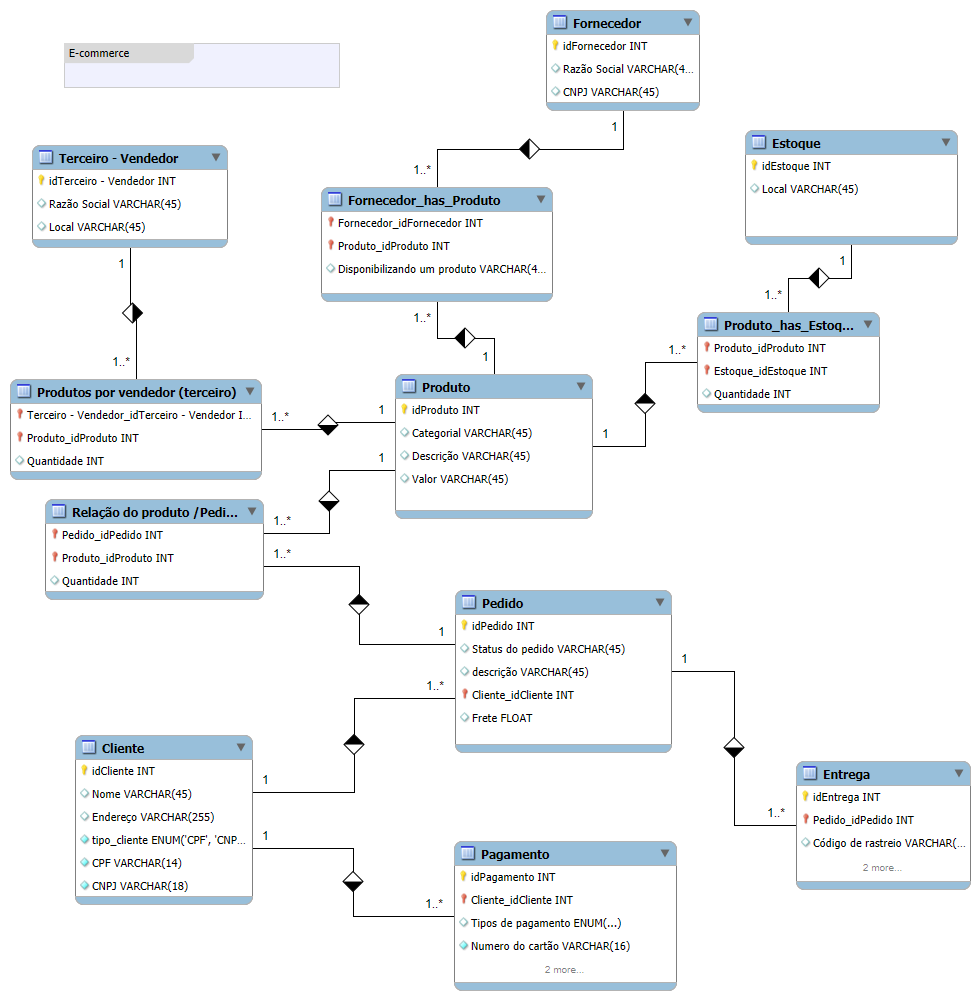

  

## 📑 Índice
- [Modelo Lógico de E-commerce](#modelo-lógico-de-e-commerce)
- [Visão Geral do Modelo](#visão-geral-do-modelo)
- [Descrição Geral](#descrição-geral)
- [Estrutura do Banco de Dados](#estrutura-do-banco-de-dados)
- [Arquivos do Repositório](#arquivos-do-repositório)
- [Como abrir o projeto](#como-abrir-o-projeto)
- [Próximos Passos](#próximos-passos)
- [Tecnologias Utilizadas](#tecnologias-utilizadas)
- [Objetivo](#objetivo)
- [Autor](#autor)
- [License](#license)

# 🛒 Modelo Lógico de E-commerce

Este repositório apresenta o **modelo lógico de um sistema de E-commerce**, desenvolvido como parte de um estudo sobre estruturação de banco de dados relacional.  
O objetivo é representar entidades, relacionamentos e regras de negócio comuns em operações de compras online.

---

## 📌 Visão Geral do Modelo

O diagrama abaixo mostra a estrutura completa do banco:

---

## 📚 Descrição Geral

O modelo foi construído com foco em:

- Controle de produtos cadastrados na plataforma  
- Gestão de fornecedores e vendedores  
- Processamento de pedidos, pagamentos e entregas  
- Registro de clientes e métodos de pagamento  
- Relação entre produtos, estoque e disponibilidades  

---

## 🗂️ Estrutura do Banco de Dados

O sistema contém as seguintes entidades principais:

- **Produto:** Catálogo de itens disponíveis na loja.  
- **Cliente:** Dados cadastrais, endereço e documentos.  
- **Pedido:** Solicitações feitas pelos clientes.  
- **Pagamento:** Formas de pagamento e status.  
- **Entrega:** Informações de rastreamento e envio.  
- **Fornecedor:** Empresas responsáveis pelos produtos.  
- **Terceiro/Vendedor:** Representações externas que vendem produtos.  
- **Estoque:** Controle de quantidade disponível por produto.

---

## 📂 Arquivos do Repositório

- **modelo-logico-ecommerce.mwb** — arquivo MySQL Workbench  
- **modelo-e-commerce.png** — imagem do modelo lógico  
- **README.md** — documentação do projeto

---

## 🧰 Como abrir o projeto

1. Faça o download do arquivo `.mwb`
2. Abra o MySQL Workbench
3. Vá em **File > Open Model**
4. Selecione o arquivo `modelo-logico-ecommerce.mwb`
5. Pronto! O modelo lógico estará disponível para visualização e edição.

---
## 🚀 Próximos Passos

- Criar o modelo físico do banco
- Gerar o script SQL automático pelo Workbench
- Popular tabelas com dados fictícios
- Criar visualizações e consultas SQL para análise

---

## 🛠️ Tecnologias Utilizadas

---

## 🎯 Objetivo

Este projeto foi criado para:

- Ajudar estudantes a entenderem modelagem lógica  
- Servir como base para implementação futura de um banco físico  
- Demonstrar boas práticas de modelagem relacional  

---

## 👤 Autor

**Fabiano Ferreira**  
🔗 [LinkedIn](https://www.linkedin.com/in/fabiano-ferreira-787100229/)  
🔗 [GitHub](https://github.com/Fabianogf12)

---

## 📝 License

This project is licensed under the MIT License.  
For more details, please refer to the **LICENSE** file in the root of this repository.

---

💬 *Fique à vontade para sugerir melhorias, abrir issues ou utilizar este modelo nos seus estudos!*
